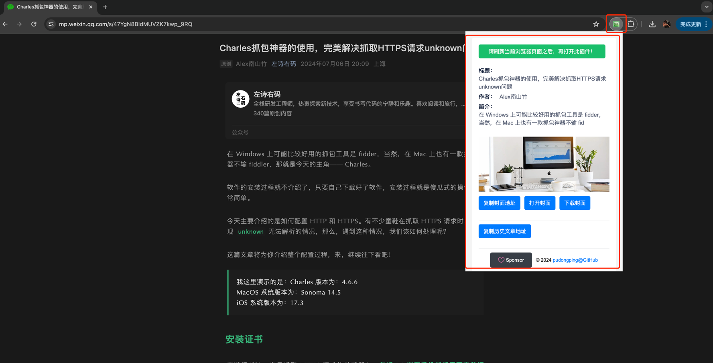
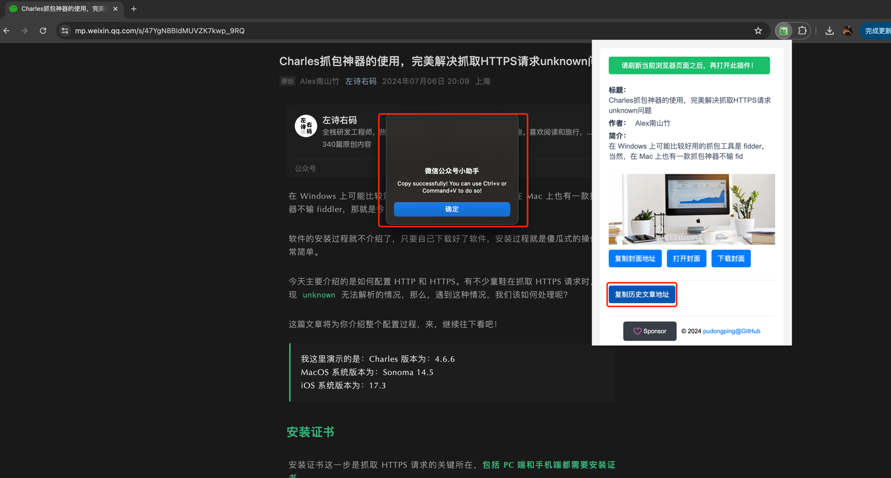
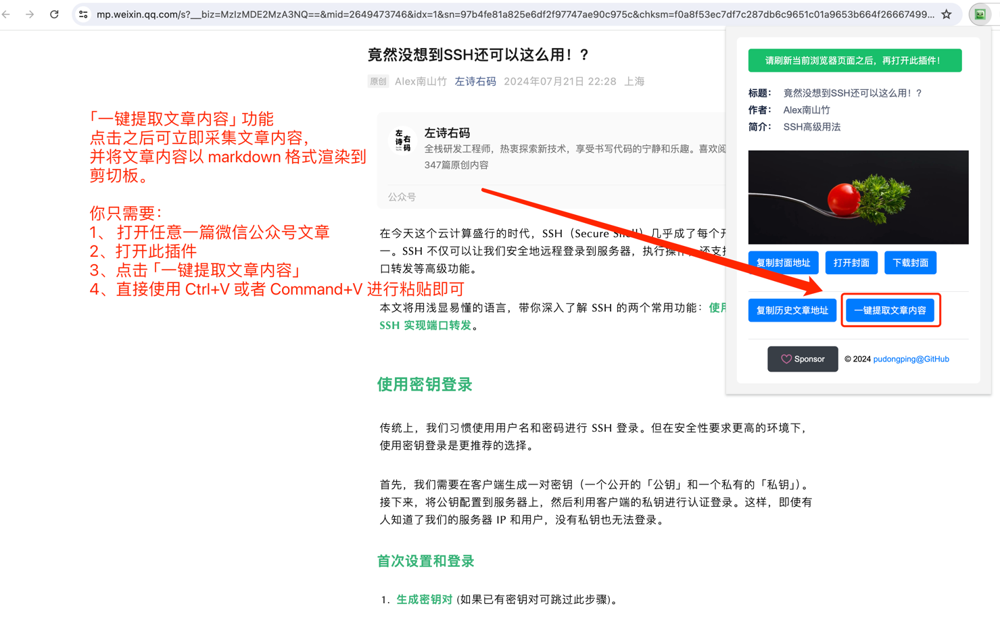
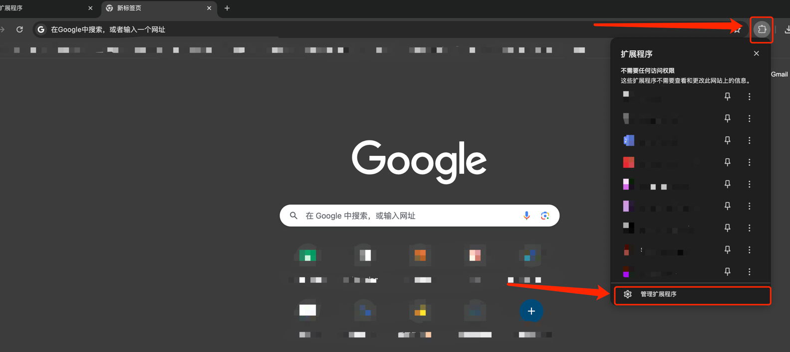
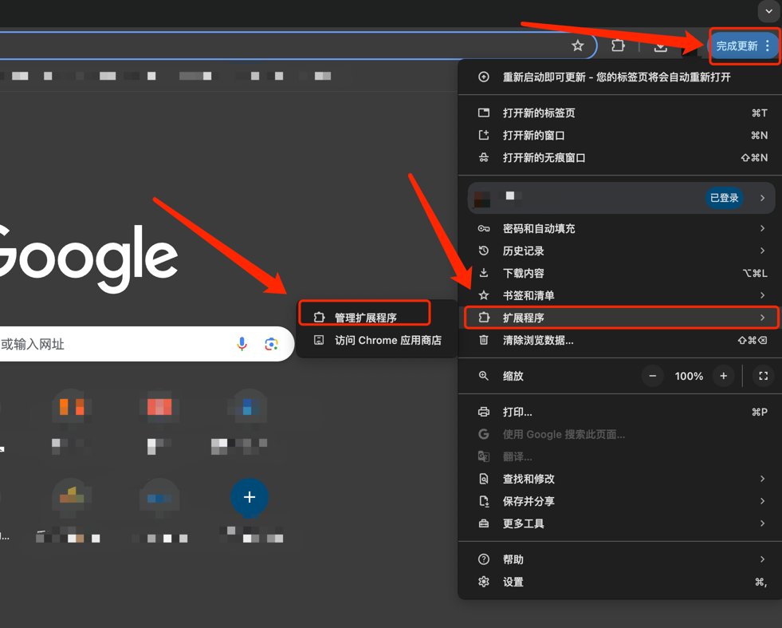
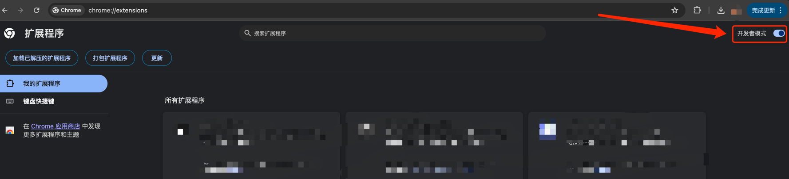
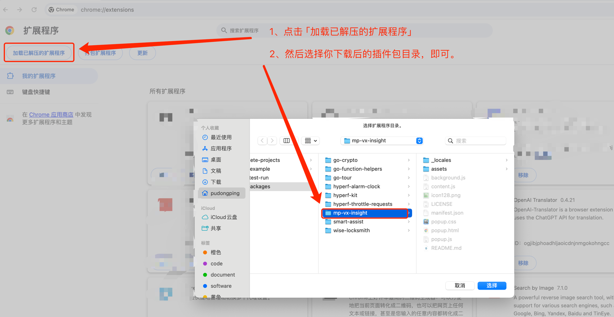
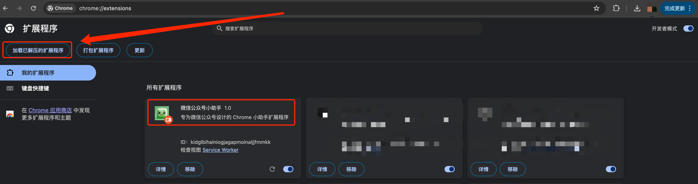

# mp-vx-insight

## 项目简介

`mp-vx-insight` 是专为**微信公众号**设计的一个 Chrome 扩展程序，用于一键获取微信公众号文章封面图、公众号全部文章等功能。

## 功能截图

自动抓取公众号数据，如：文章标题、文章作者、文章简介、文章封面图地址



可获取当前公众号的历史文章地址，复制之后，可直接粘贴使用。**需要使用微信的浏览器打开**




可一键提取文章内容，采集的文章内容在系统剪切板中，可通过 `Ctrl+V` 或者 `Command+V` 直接**粘贴**使用（20240722 新增功能）



## 教程

- [（内附视频）这个公众号小扩展，可助你一臂之力！写公众号的小伙伴们，赶紧用起来！](https://mp.weixin.qq.com/s?__biz=MzIzMDE2MzA3NQ==&mid=2649473678&idx=1&sn=717ffcbdc8c6243680e4315b677bd365&chksm=f0a8f562c7df7c7417ac9c6b713ee051cc10d73414390147189fabc3cb0c26b1f8782d247b14&token=2003546410&lang=zh_CN#rd)

## 使用说明

### 1. 获取源码

```bash
# 如果你可以通过 git 拉取源码时，则：
git clone https://github.com/pudongping/mp-vx-insight.git ~/mp-vx-insight

# 或者也可以直接通过浏览器直接下载源码
wget https://github.com/pudongping/mp-vx-insight/archive/refs/heads/master.zip
```

### 2. 加载插件

#### 2-1、打开 Chrome 浏览器，然后打开**插件管理页面**

有多种方式都可以打开，以下，我提供三种方式，任选其一即可。

- 第一：可以直接访问 `chrome://extensions` 进行打开；


- 第二：通过「扩展程序」->「管理扩展程序」进行打开；



- 第三：通过「设置」->「扩展程序」->「管理扩展程序」进行打开；



#### 2-2、开启「开发者模式」



一定要开启「开发者模式」。

#### 2-3、加载插件



点击左上角的「加载已解压的扩展程序」，然后直接选择插件目录即可。

> 这里选择的目录，就是刚刚第一步，你下载源码后的那个目录。



然后我们就可以看到插件已经安装成功了！现在就好好的玩耍吧！

## 注意


每次使用此插件的时候，都需要**先**打开微信公众号文章页面，**刷新一下页面** 之后，**然后再**打开此插件页面。  
否则是**无法获取到公众号文章数据的嗷！**

## Star History

<a href="https://star-history.com/#pudongping/mp-vx-insight&Date">
 <picture>
   <source media="(prefers-color-scheme: dark)" srcset="https://api.star-history.com/svg?repos=pudongping/mp-vx-insight&type=Date&theme=dark" />
   <source media="(prefers-color-scheme: light)" srcset="https://api.star-history.com/svg?repos=pudongping/mp-vx-insight&type=Date" />
   
 </picture>
</a>